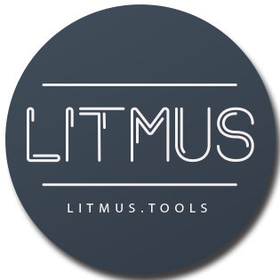

# litmus.tools

This repository is an under construction git involving building a website that helps users make their financial decisions with ease with a simple calculator tool.

 

  

  <h3 align="center">litmus.tools</h3>

  

    A financial calculator. 
     
    <a href="https://github.com/Afrokk/litmus.tools"><strong>Work in Progress. »</strong></a>
     
  

## About The Project

Litmus.tools is an upcoming full-stack web-app that makes it extremely easy and straight forward to calculate your income, taxes based on location, gather insights and plan out your budget - all in one place. All you need to do is enter your income and expenses into the calculator and it will do the rest!

## Built With
Work in progress. Currently using:

### Development
* [![React][React.com]][React-url]
[![TypeScript][TypeScript.com]][TypeScript-url]
[![SASS][SASS.com]][SASS-url]
[![JavaScript][JavaScript.com]][JavaScript-url]
[![Yarn][Yarn.com]][Yarn-url]

* More to be added.

### Design/Prototyping
* 

### Collaboration
* 

## Design
Here's a look at the design of the website on different devices.

## Roadmap
Some of the things in-plans with this project:

- [x] Complete Home Page.
- [x] Complete About Page. 
- [x] Complete Tickets Page.
- [x] Complete Venue Page. 
- [x] Optimize. - PROJECT COMPLETED.

## Created by

Usman Abdul Jabbar - [@usmangta](https://www.instagram.com/usmangta/) - [LinkedIn](https://www.linkedin.com/in/usman-abdul-jabbar/) - hi@usmanjabbar.com

Afrasiyab (Afrokk) Khan - [@afrokk_](https://www.instagram.com/afrokk_/) - [afrokk.design](https://afrokk.design/) - [afrokk.dev](https://afrokk.dev/) - [LinkedIn](https://www.linkedin.com/in/afrasiyab-k/) - afrasiyabkhan379@gmail.com

Project Link: [https://github.com/Afrokk/litmus.tools](https://github.com/Afrokk/litmus.tools)

[product-screenshot]: images/clip.jpg
[React.com]: https://img.shields.io/badge/React-20232A?style=for-the-badge&logo=react&logoColor=61DAFB
[React-url]: https://reactjs.org/
[TypeScript.com]: https://img.shields.io/badge/TypeScript-007ACC?style=for-the-badge&logo=typescript&logoColor=white
[TypeScript-url]: https://www.typescriptlang.org/
[SASS.com]: https://img.shields.io/badge/Sass-CC6699?style=for-the-badge&logo=sass&logoColor=white
[SASS-url]: https://sass-lang.com/
[JavaScript.com]: https://img.shields.io/badge/JavaScript-323330?style=for-the-badge&logo=javascript&logoColor=F7DF1E
[JavaScript-url]: https://en.wikipedia.org/wiki/JSX_(JavaScript)
[Yarn.com]: https://img.shields.io/badge/JavaScript-323330?style=for-the-badge&logo=javascript&logoColor=F7DF1E
[Yarn-url]: https://en.wikipedia.org/wiki/JSX_(JavaScript)
[Yarn.com]: https://img.shields.io/badge/JavaScript-323330?style=for-the-badge&logo=javascript&logoColor=F7DF1E
[Yarn-url]: https://yarnpkg.com/
[Yarn.com]: https://img.shields.io/badge/JavaScript-323330?style=for-the-badge&logo=javascript&logoColor=F7DF1E
[Yarn-url]: https://yarnpkg.com/
