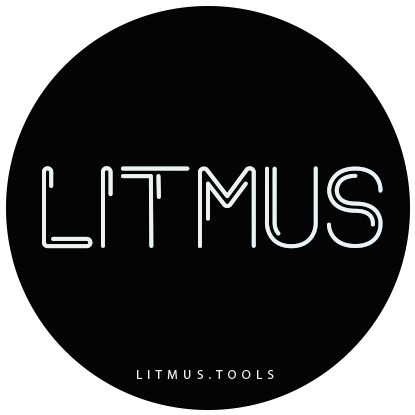
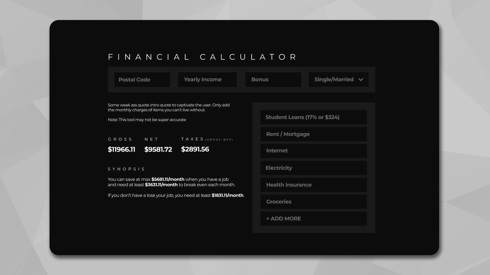
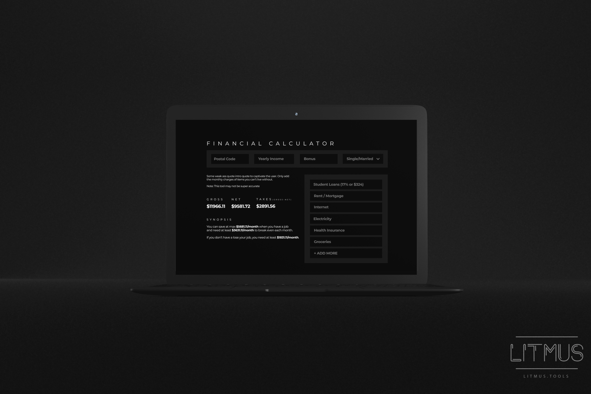
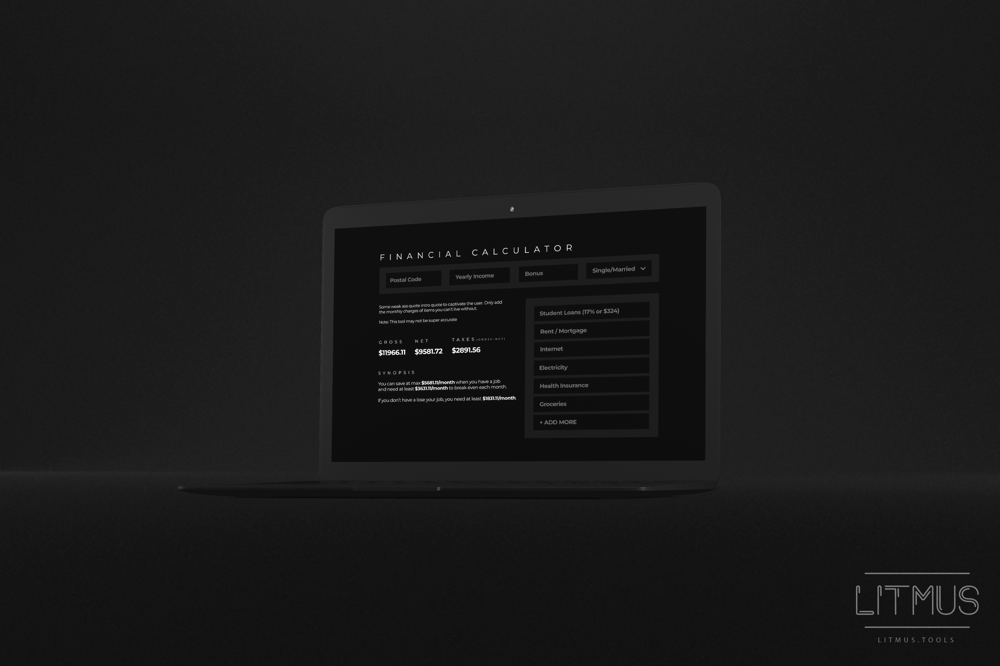

 

  

  <h3 align="center">litmus.tools</h3>

  

    Money matters. Track your finances and save. 
     
    <a href="https://github.com/Afrokk/litmus.tools"><strong>Work in Progress. »</strong></a>
     
  

## About The Project

Litmus.tools is an upcoming full-stack web-app that makes it extremely easy and straight forward to calculate your income, taxes (based on location), gather insights, and plan out your budget - all in one place. All you need to do is enter your income and expenses into the calculator and it will do the rest!

## Built With
Work in progress. Currently using:

### Development
* [![React][React.com]][React-url]
* [![TypeScript][TypeScript.com]][TypeScript-url]
* [![Yarn][Yarn.com]][Yarn-url]
* [![SASS][SASS.com]][SASS-url]
* [![JavaScript][JavaScript.com]][JavaScript-url]

_More to be added._

### Design/Prototyping
* [![Figma][Figma.com]][Figma-url]
* [![Photoshop][Photoshop.com]][Photoshop-url]

### Collaboration/Version Control
* [![Jira][Jira.com]][Jira-url]
* [![Git][Git.com]][Git-url]
* [![GitHub][GitHub.com]][GitHub-url]

## Design
Initial design of the app. Simple, minimal and sleek.

    

    

    

## Roadmap
Some of the things in-plans with this project:

- [x] Create individual React components from scratch.
- [x] Handle component-level validation.
- [x] Test components.
- [ ] Implement back-end using Python/Flask.
- [ ] Build bugeting-list.

_More to be added._
_Progress [here](https://github.com/Afrokk/litmus.tools/pulls?q=is%3Apr+is%3Aclosed)._

## Created by

Usman Abdul Jabbar - [@usmangta](https://www.instagram.com/usmangta/) - [LinkedIn](https://www.linkedin.com/in/usman-abdul-jabbar/) - hi@usmanjabbar.com

Afrasiyab (Afrokk) Khan - [@afrokk_](https://www.instagram.com/afrokk_/) - [afrokk.design](https://afrokk.design/) - [afrokk.dev](https://afrokk.dev/) - [LinkedIn](https://www.linkedin.com/in/afrasiyab-k/) - afrasiyabkhan379@gmail.com

Project Link: [https://github.com/Afrokk/litmus.tools](https://github.com/Afrokk/litmus.tools)

[product-screenshot]: images/clip.jpg
[React.com]: https://img.shields.io/badge/React-20232A?style=for-the-badge&logo=react&logoColor=61DAFB
[React-url]: https://reactjs.org/
[TypeScript.com]: https://img.shields.io/badge/TypeScript-007ACC?style=for-the-badge&logo=typescript&logoColor=white
[TypeScript-url]: https://www.typescriptlang.org/
[SASS.com]: https://img.shields.io/badge/Sass-CC6699?style=for-the-badge&logo=sass&logoColor=white
[SASS-url]: https://sass-lang.com/
[JavaScript.com]: https://img.shields.io/badge/JavaScript-323330?style=for-the-badge&logo=javascript&logoColor=F7DF1E
[JavaScript-url]: https://en.wikipedia.org/wiki/JSX_(JavaScript)
[Yarn.com]: https://img.shields.io/badge/Yarn-2C8EBB?style=for-the-badge&logo=yarn&logoColor=white
[Yarn-url]: https://yarnpkg.com/
[Figma.com]: https://img.shields.io/badge/Figma-F24E1E?style=for-the-badge&logo=figma&logoColor=white
[Figma-url]: https://www.figma.com/
[Photoshop.com]: https://img.shields.io/badge/Adobe%20Photoshop-31A8FF?style=for-the-badge&logo=Adobe%20Photoshop&logoColor=black
[Photoshop-url]: https://www.adobe.com/ca/products/photoshop.html
[Jira.com]: https://img.shields.io/badge/Jira-0052CC?style=for-the-badge&logo=Jira&logoColor=white
[Jira-url]: https://jira.com/
[Git.com]: https://img.shields.io/badge/GIT-E44C30?style=for-the-badge&logo=git&logoColor=white
[Git-url]: https://git-scm.com/
[GitHub.com]: https://img.shields.io/badge/GitHub-100000?style=for-the-badge&logo=github&logoColor=white
[GitHub-url]: https://github.com/
